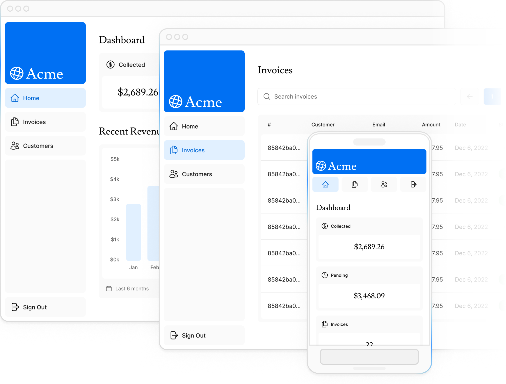
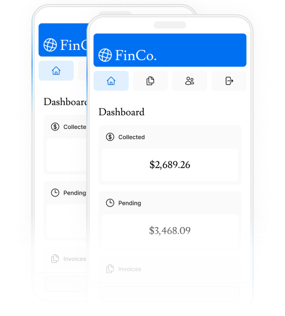

# Acme Invoice Dashboard

A portfolio project based on the [Next.js Learn Dashboard course](https://nextjs.org/learn). It is a server-rendered dashboard for invoice and customer records, backed by PostgreSQL and Auth.js credential authentication.

## Features

- Dashboard cards, revenue chart, and latest invoices.
- Invoice search and pagination, plus create, update, and delete actions.
- Customer search with responsive mobile cards and desktop table views.
- Credential login backed by PostgreSQL and bcrypt password verification.
- Zod validation, loading states, error boundaries, and pending feedback on forms.
- Request-time rendering for database-backed dashboard data that should remain current.

## Course Foundation And Project Additions

The project keeps the course's App Router, Server Component, PostgreSQL query, Server Action, and Auth.js patterns. Additional work in this project includes:

- Development-only seed and debug-query endpoints; seed writes run in a transaction.
- Session checks at the invoice mutation Server Action boundary.
- Working invoice deletion and a completed customer listing page.
- Dashboard card de-duplication, current database reads, form pending feedback, and debounced accessible search/navigation.

## Technology

- Next.js App Router, React, and TypeScript
- Tailwind CSS and Heroicons
- PostgreSQL with the `postgres` JavaScript client
- Auth.js credentials provider and bcrypt
- Zod validation
- pnpm workspace and lockfile

## Requirements

- Node.js 20.9 or newer
- pnpm
- A PostgreSQL database that accepts SSL connections

## Local Setup

1. Install dependencies:

	```sh
	pnpm install
	```

2. Copy `.env.example` to `.env` and fill in the values locally. `.env` is ignored by Git; never commit it.

3. Set up a PostgreSQL database. The seed route uses `uuid_generate_v4()`, so ensure the `uuid-ossp` extension is available. If needed, enable it in the database:

	```sql
	CREATE EXTENSION IF NOT EXISTS "uuid-ossp";
	```

4. Start the development server:

	```sh
	pnpm dev
	```

5. While the development server is running, open `http://localhost:3000/seed` once to create the tables and insert the course sample data. The endpoint returns 404 outside development and should only be used with a development database.

6. Open `http://localhost:3000/login` and sign in with the local sample account from `app/lib/placeholder-data.ts`:

	- Email: `user@nextmail.com`
	- Password: `123456`

	These are public course placeholder credentials for local demonstration only. Do not reuse them for a deployed database.

## Environment Variables

`.env.example` intentionally contains names only. Configure values in your untracked `.env` file or your deployment provider's secret settings.

| Variable | Purpose |
| --- | --- |
| `POSTGRES_URL` | SSL-enabled PostgreSQL connection string used by the database client. |
| `AUTH_SECRET` | Secret used by Auth.js to protect session data. Use a unique, randomly generated value. |
| `AUTH_URL` | Optional canonical application URL when it is not detected automatically or is required by the host. |

## Architecture

- Pages and layouts live in `app/`; dashboard pages use Server Components where appropriate.
- SQL reads and formatting live in `app/lib/data.ts`; database access uses parameterized `postgres` queries rather than an ORM.
- Invoice mutations live in `app/lib/actions.ts` as Server Actions. Zod validates form input, authenticated sessions are checked at the action boundary, and successful mutations revalidate the invoice route.
- Client form components use `useActionState` for validation results and pending state. Search updates URL parameters through the Next.js router.
- `auth.ts` configures Auth.js credentials and bcrypt verification. `proxy.ts` protects dashboard navigation, while invoice mutations also check authentication directly.

## Screenshots

The repository includes course-provided responsive dashboard preview assets, also used on the home page. They illustrate the project but are not fresh captures of every project addition.





## Build And Run

```sh
pnpm build
pnpm start
```

The repository does not currently define separate lint or test scripts. The production build runs the Next.js compilation and TypeScript checks.

## Deployment

Deploy with a Next.js-compatible Node host, such as Vercel, and configure `POSTGRES_URL` and `AUTH_SECRET` in the host's environment settings. Set `AUTH_URL` if required by the host. Use a production PostgreSQL database with SSL enabled.

The `/seed` endpoint is intentionally unavailable in production. This repository has no production migration or user-provisioning workflow, so provision the production schema and initial account through a controlled database/migration process before enabling the application. Never use the course sample account or a development database in production.

## Known Limitations

- Invoice and customer rows are shared by all authenticated users; the schema has no user ownership or role model.
- There is no sign-up, password reset, or admin account-management interface.
- The seed route creates the course tables and sample data only in development. Production schema migrations are not included.
- The revenue data function includes an intentional three-second course demonstration delay.
- Customer search is available, but customer pagination is not implemented.
